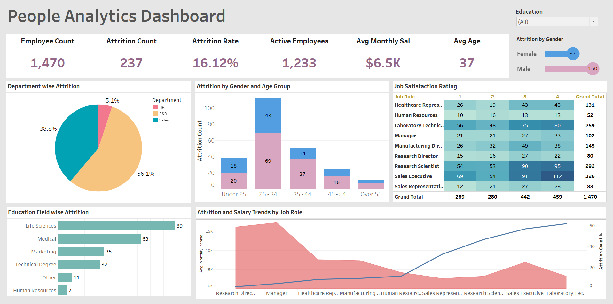

# People Analytics Dashboard

## Overview
This **People Analytics Dashboard** provides a comprehensive view of key HR metrics to support data-driven workforce management decisions. Built using Tableau, the dashboard visualizes employee data across multiple dimensions, including attrition trends, demographic breakdowns, job satisfaction, salary distribution, and department-wise metrics.

**Link to the Dashboard**: https://public.tableau.com/app/profile/kajal.shethia/viz/PeopleAnalyticsDashboard_17368176367070/PeopleAnalyticsDashboard 

## Key Features
- **Summary KPIs**: Total employee count, attrition rate, active employees, average monthly salary, and average age.
- **Demographic Insights**: Attrition analysis by gender and age group, highlighting patterns across different categories.
- **Department Analysis**: Attrition distribution across departments and educational fields.
- **Job Role Insights**: Trends in job satisfaction ratings and salary comparisons across job roles.

This dashboard empowers HR teams to identify critical factors driving attrition, evaluate workforce trends, and design targeted interventions to improve retention and employee satisfaction.
